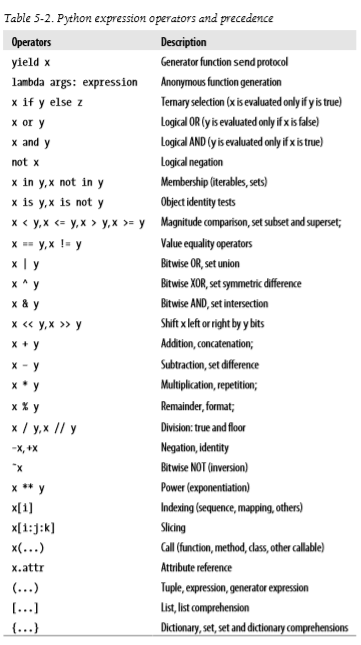

# 类型和运算 (Types and Operations)

## Introducing Python Object Types

在非正式的意义上, 在 Python 中, 我们用一些东西做事情. 

- "事物" 采取像加法和串联的形式的操作。
- "东西" 是指我们执行这些操作的对象。

从更正式的角度来看，在 Python 中，数据以**对象**的形式出现。

>  As we’ll see, *everything* is an object in a Python script. Even simple numbers qualify, with values (e.g., 99), and supported operations (addition, subtraction, and so on). 

### The Python Conceptual Hierarchy (概念上的层级结构)

1. Programs are composed of modules. (程序由模块构成)
2. Modules contain statements. (模块包含语句)
3. Statements contain expressions. (语句包含表达式)
4. *Expressions create and process objects*. (表达式建立和处理对象)


###  Built-in Types (内置类型)


- **在 Python 中没有类型声明，运行的表达式的语法决定了创建和使用的对象的类型。**
- **一旦创建了一个对象，它就和操作集合绑定了**——只能对一个字符串执行字符串操作，并在列表上进行列表相关操作。

在正式术语中, 这意味着 Python 是动态类型的, 它会自动跟踪类型, 而不是要求声明代码, 但它也是强类型的, 这意味着您可以在仅对象操作上执行对其j进行适合该类型的有效操作。

在 Python 中的每一个对象都可以分为不可变性和可变性。比如数字、字符串、元组是不可变的。**不可变的**：在创建后不能就地改变。

**多态**意味着一个操作符 (如 `+`) 的意义取决于被操作的对象。这将是 Python 的关键思想：**不要将代码限制在特定的类型上，使代码自动适用于多种类型。**

## 数字类型 (Numeric Types)

> In Python, numbers are not really a single object type, but a category of similar types. 

完整的 Python 数值类型清单：
 
英文|中文
:-|:-
Integer and floating-point objects|整数和浮点数
Complex number objects|复数
Decimal: fixed-precision objects|固定精度的十进制数
Fraction: rational number objects|有理分数
Sets: collections with numeric operations|具有数值运算的集合
Booleans: true and false|布尔类型
Built-in functions and modules: `round`, `math`, `random`, etc.|数值相关的内建函数和模块
Expressions; unlimited integer precision; bitwise operations; hex, octal, and binary formats|表达式; 无穷的整数精度; 按位运算; 16 进制; 8 进制; 2 进制
Third-party extensions: vectors, libraries, visualization, plotting, etc.|第三方扩展

### Numeric Literals (数值常量)


> Integers may be coded in decimal (base 10), hexadecimal (base 16), octal (base 8), or binary (base 2), the last three of which are common in some programming domains. Hexadecimals start with a leading `0x` or `0X`, followed by a string of hexadecimal digits ($0\sim 9$ and $A\sim F$). Hex digits may be coded in lower- or uppercase. Octal literals start with a leading `0o` or `0O` (zero and lower- or uppercase letter `o`), followed by a string of digits ($0\sim 7$). In 2.X, octal literals can also be coded with just a leading `0`, but not in 3.X—this original octal form is too easily confused with decimal, and is replaced by the new `0o` format, which can also be used in 2.X as of 2.6. Binary literals, new as of 2.6 and 3.0, begin with a leading `0b` or `0B`, followed by binary digits ($0\sim 1$). 



### Floor 除法和截断除法

请注意，在 Python 3.X 中 `//` (floor, 向下取整) 运算: 如果是浮点型, 则结果为浮点型;否则, 它是一个整数。下面展示一些 Floor 除法和截断除法的运算：


```python
20 // 3
```


    6


```python
20. // 3
```


    6.0


```python
from math import floor, trunc
```


```python
floor(2.5)
```


    2


```python
floor(-2.5)
```


    -3


```python
trunc(2.5)
```


    2


```python
trunc(-2.5)
```


    -2


```python
5 / 2, 5 / -2
```


    (2.5, -2.5)


```python
5 // 2, 5 // -2
```


    (2, -3)


```python
5 / 2., 5 / -2.
```


    (2.5, -2.5)


```python
5 // 2., 5 // -2.
```


    (2.0, -3.0)


```python
trunc(5 / -2)
```


    -2


### 进制数


```python
0o1, 0o20, 0o377 # 八进制
```


    (1, 16, 255)


```python
0x01, 0x10, 0xFF  # 十六进制
```


    (1, 16, 255)


```python
0b1, 0b10000, 0b11111111  # 二进制
```


    (1, 16, 255)


```python
oct(64), hex(64), bin(64)
```


    ('0o100', '0x40', '0b1000000')


`int` 会将一个数字的字符串变换为一个整数,并且通过第二个参数来确定变换后的数字进制：


```python
int('64'), int('100', 8), int('40', 16), int('1000000', 2)
```


    (64, 64, 64, 64)


```python
int('0x40', 16), int('0b1000000', 2)
```


    (64, 64)


```python
eval('64'), eval('0o100'), eval('0x40'), eval('0b1000000')
```


    (64, 64, 64, 64)


```python
'{0:0}, {1:x}, {2:b}'.format(64, 64, 64)
```


    '64, 40, 1000000'


```python
'%o, %x, %X' % (64, 255, 255)
```


    '100, ff, FF'


### 位操作


```python
x = 1

x << 2 # Shift left 2 bits
```


    4


```python
x | 2   # Bitwise OR
```


    3


```python
x & 1  # Bitwise AND
```


    1


```python
X = 99
```


```python
bin(X), X.bit_length()  # `X.bit_length()` 获得二进制字符串的长度
```


    ('0b1100011', 7)


```python
round(1/3, 7)
```


    0.3333333


使用**分数**和**小数**可以避免精度的损失！

### 小数


```python
from decimal import Decimal, getcontext
```


```python
Decimal(0.1)
```


    Decimal('0.1000000000000000055511151231257827021181583404541015625')


```python
Decimal.from_float(1.25)
```


    Decimal('1.25')


#### 设置全局精度


```python
Decimal(1) / Decimal(7)
```


    Decimal('0.1428571428571428571428571429')


```python
getcontext().prec
```


    28


```python
getcontext().prec = 4   # 改变全局精度
```


```python
Decimal(1) / Decimal(7)
```


    Decimal('0.1429')


### 分数


```python
from fractions import Fraction
```


```python
x = Fraction(1, 3)
x
```


    Fraction(1, 3)


```python
y = Fraction(4, 6)
y
```


    Fraction(2, 3)


```python
x + y
```


    Fraction(1, 1)


```python
x - y
```


    Fraction(-1, 3)


```python
x * y
```


    Fraction(2, 9)


```python
Fraction('.25')
```


    Fraction(1, 4)


```python
Fraction('1.25')
```


    Fraction(5, 4)


```python
Fraction('.25') + Fraction('1.25')
```


    Fraction(3, 2)


分数还有一个 `from_float` 方法，并且接受一个 `Fraction` 作为参数。


```python
(2.5).as_integer_ratio()
```


    (5, 2)


```python
f = 2.5
z = Fraction(*f.as_integer_ratio())
z
```


    Fraction(5, 2)


```python
x
```


    Fraction(1, 3)


```python
float(x)
```


    0.3333333333333333


```python
Fraction.from_float(1.75)
```


    Fraction(7, 4)


```python
a = x + Fraction(*(4.0/3).as_integer_ratio())
a
```


    Fraction(22517998136852479, 13510798882111488)


```python
a.limit_denominator(10)   # 取近似
```


    Fraction(5, 3)


