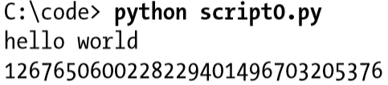
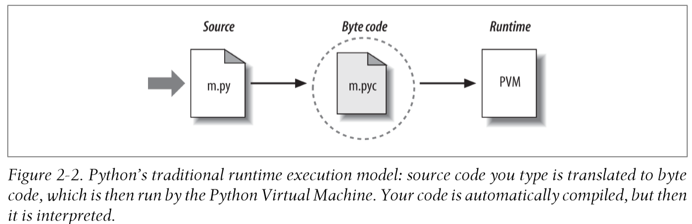

# Python 如何运行程序？

## 程序员视角

在最简单的形式中, python 程序只是一个包含 Python 语句的文本文件。



## Python 视角

当您指示 python 运行脚本时, 在代码实际开始计算之前, python 将执行一些步骤。具体地说, 它首先编译为名为 "字节代码" (byte code), 然后转发到所谓的 "虚拟机" (“virtual machine)。

### Byte code compilation (字节码编译)

当 Python 执行时，Python 内部 (对大多数用户是完全隐藏的) 会将源代码 (文件中的语句) 编译为字节码的形式。编译只是一个转换步骤, 而字节代码是源代码的一个与平台无关的更低级别的表示形式。大致上, Python 将每个源语句转换为一组字节代码指令, 方法是将它们分解为各个步骤。此字节代码转换执行以加快执行-字节代码可以比文本文件中的原始源代码语句运行得更快。

如果 Python 进程在您的计算机上具有写访问权限, 则它会将程序的字节代码存储在以 `.pyc` 扩展名结尾的文件中 ("`.pyc`" 是指编译的 "`.py`" 源)。在 Python 3.2 之前, 您将看到这些文件显示在您的计算机上后, 您已经运行了几个程序旁边的相应的源代码文件-即, 在同一目录中。例如, 在导入 (import) `script.py` 后, 您会看到 `script.pyc`。在3.2 和更高版本中, Python 会将其 `.pyc` 字节代码文件保存在源文件所在的目录中名为 `__pycache__` 的子目录中, 并在其名称标识创建它们的 Python 版本的文件中 (例如, `script.cpython-33.pyc`)。新的 `__pycache__` 子目录有助于避免杂乱 (clutter), 并且字节代码文件的新命名约定可防止安装在同一台计算机上的不同 Python 版本覆盖彼此保存的字节代码。

在这两种模型中, Python 都将像这样的保存为字节代码来作为启动速度的优化。下次运行程序时, Python 将加载 `.pyc` 文件并跳过编译步骤, 只要您没有更改源代码, 因为上次保存了字节代码, 并且没有使用与创建字节代码相同的 Python 运行。它的工作原理如下:

- Source changes: Python 会自动检查源代码和字节代码文件的最后修改时间戳, 以了解它何时必须重新编译-如果您编辑和重新保存您的源代码, 则在下次运行程序时, 将自动重创建字节代码.
- Python versions: 导入还检查是否必须重新编译该文件, 因为它是由不同的 Python 版本创建的, 使用字节代码文件本身中的 "魔力" 版本号在 3.2 和更早, 或者在 3.2 中字节代码文件名中存在的信息后来。

### The Python Virtual Machine (PVM)

一旦将程序编译为字节代码 (或已从现有的 `.pyc` 文件加载字节代码) 后, 它将被发送到通常称为 Python 虚拟机 (PVM, 在您中更倾向于缩写) 上来执行。



### Frozen Binaries (冻结二进制文件)

有时人们需要 "真正的" Python 编译器时, 他们真正寻求的只是一种从其 Python 程序生成独立二进制可执行文件的方法。这是一个比执行流概念更接近于打包分发的东西, 但它有点关联。借助可从 Web 上获取的第三方工具, 可以将 python 程序转换为真正的可执行文件 (在 python 世界中称为 "冻结二进制文件")。这些程序可以在不需要 Python 安装的情况下运行。

如今, 各种系统都能够生成冻结的二进制文件, 这在平台和功能上有所不同: 仅适用于 windows 的 `py2exe`, 但具有广泛的 windows 支持; `PyInstaller` 类似于 py2exe, 但也适用于 Linux 和 Mac OS X, 能够生成自安装二进制文件; py2app 用于创建 Mac OS X 应用程序;`freeze`, 原件; `cx_freeze` 提供 Python 3.X 和跨平台支持。您可能需要从 Python 本身单独获取这些工具, 但它们是免费提供的。

## 模块重载

```{.python .input  n=3}
from imp import reload
```

`reload` 函数载入并运行文件最新版的代码，如果已经在一个窗口中修改并保存了它，那就会反应出修改的变化。`reload` 函数的返回值是一个 Python 模块对象。
