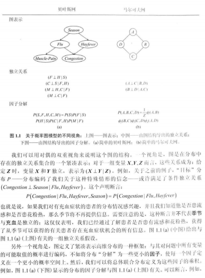

# 概率图模型

概率图模型把基于图的表示作为在高维空间上紧凑编码复杂分布的基础. 下图中, 节点 (或椭圆) 与问题中的变量对应, 而边与它们之间的直接概率交互对应:

- 在线查询: http://pgm.stanford.edu/
- 中译本: 概半图模型：原理与技术 / (美国) Kollcr D., (以) Friedman N. 著, 王飞跃, 韩素青译. 北京: 清华大学出版社, 2015.

## 基础知识

### 概率论

#### 事件空间

形式上, 我们通过假定存在一个可能结果的约定**空间** (space) 来定义**事件** (event), 并记作 $\Omega$.

#### 随机变量

我们使用大写的罗马字母 $X, Y, Z$ 表示随机变量, 小写的字母 $x,y,z$ 表示随机变量的取值; 使用黑体 $\boldsymbol{X}$ 表示随机变量的集合, 而 $\boldsymbol{x}$ 表示随机变量取值的集合. 对于 $\boldsymbol{Y \subset X, x\langle Y \rangle}$ 表示在 $\boldsymbol{x}$ 的取值范围内对 $\boldsymbol{Y}$ 中变量的赋值. 若 $\boldsymbol{x\langle X \cap Y \rangle = y\langle X \cap Y \rangle}$, 则称 $\boldsymbol{x \sim y}$. 记 $P(X=x)$ 为 $P(x)$, $P(X=x,Y=y)$ 为 $P(x,y)$.

定义了随机变量 $X$, 我们可以考虑其分布, 通常称为 $X$ 的**边缘分布** (margin distribution), 记作 $P(X)$. 随机变量集 $\mathcal{X} = \{X_1, X_2, \cdots, X_n\}$ 上的**联合分布** (joint distribution) 由 $P(X_1, X_2, \cdots, X_n)$ 表示, 并且它是为依据这些随机变量具体指定的事件确定概率的分布. 我们使用 $\xi$ 表示对 $\mathcal{X}$ 中所有变量的完全赋值.

通常使用符号 $P(X|Y)$ 表示条件概率分布的集合. 直觉上, 就是对 $Y$ 的每一个值, 用条件概率为 $X$ 的每一个取值指定一个概率. 这个符号使得链式法则可以简写为 $P(X,Y) = P(X)P(Y|X)$, 并且可以扩展为:

$$
P(X_1,\cdots, X_k) = P(X_1)P(X_2|X_1)\cdots P(X_K|X_{k-1})
$$

类似地, 可以使用条件概率分布表示贝叶斯规则:

$$
P(X|Y) = \frac{P(X)P(Y|X)}{P(Y)}
$$

#### 独立性

定义1: 假如 $P(\alpha|\beta) = P(\alpha)$ 或者 $P(\beta)=0$, 则称事件 $\alpha$ 和事件 $\beta$ 在 $P$ 中**独立**, 记作 $P \models (\alpha \bot \beta)$.

命题1: 分布 $P$ 满足 $(\alpha \bot \beta)$ 当且仅当 $P(\alpha\cap \beta) = P(\alpha)P(\beta)$.

定义2: 假如 $P(\alpha|\beta \cap \nu) = P(\alpha|\nu)$ 或者 $P(\beta \cap \nu)=0$, 则称事件 $\alpha$ 在给定事件 $\nu$ 时在分布 $P$ 中**条件独立**于事件 $\beta$, 记作 $P \models (\alpha \bot \beta|\nu)$.

命题2: 分布 $P$ 满足 $(\alpha \bot \beta|\nu)$ 当且仅当 $P(\alpha\cap \beta|\nu) = P(\alpha|\nu)P(\beta|\nu)$.

#### 随机变量的独立性

定义3: 令 $\boldsymbol{X, Y, Z}$ 表示随机变量的集合. 在给定 $\boldsymbol{Z}$ 时, 假如对于所有的值 $x\in Val(\boldsymbol{X}), y \in Val(\boldsymbol{Y})$ 以及 $z \in Val(\boldsymbol{Z})$, $P$ 满足 $\boldsymbol{(X=x \bot Y=y |Z=z)}$, 则称集合 $\boldsymbol{X}$ 与 $\boldsymbol{Y}$ 在分布 $P$ 中条件独立. 集合 $\boldsymbol{Z}$ 中的变量通常称为**观测** (observed) 变量. 如若集合 $\boldsymbol{Z}$ 是空集, 可以把 $\boldsymbol{(X\bot Y|∅)}$ 记作 $\boldsymbol{(X \bot Y)}$, 并称 $\boldsymbol{X}$ 与 $\boldsymbol{Y}$ 是**边缘独立的** (marginally independent).

因此, 有关随机变量独立性的陈述是关于随机变量所有可能值的一个通用的量化.

命题3: 分布 $P$ 满足 $\boldsymbol{(X \bot Y|Z)}$ 当且仅当 $P(\boldsymbol{X,Y|Z}) = P(\boldsymbol{X|Z})P(\boldsymbol{Y|Z})$

一些有用的性质:

- **对称** (symmetry): $\boldsymbol{(X \bot Y|Z) \Rightarrow (Y \bot X|Z)}$;
- **分解** (decomposition): $\boldsymbol{(X \bot Y, W|Z) \Rightarrow (X \bot Y|Z) }$;
- **弱联合** (weak union): $\boldsymbol{(X \bot Y, W|Z) \Rightarrow (X \bot Y|Z, W) }$;
- **收缩** (contraction): $\boldsymbol{(X \bot W|Z, Y) \,\&\, (X \bot Y|Z)\Rightarrow (X \bot Y, W|Z) }$.

定义4: 若对于所有满足 $\alpha \neq 0$ 的事件 $\alpha \in \mathcal{S}, P(\alpha) > 0$ 成立, 则称 $P$ 为**正分布** (positive distribution).

### 查询一个分布

#### 概率查询

**概率查询** 由两个部分组成:

- **证据**: 模型中随机变量的子集 $\boldsymbol{E}$, 以及这些变量的实例 $\boldsymbol{e}$;
- **查询变量**: 网络中随机变量的子集 $\boldsymbol{Y}$.

任务是计算

$$
P(\boldsymbol{Y|E=e})
$$

即, $\boldsymbol{Y}$ 的值 $\boldsymbol{y}$ 上的后验概率分布取决于 $\boldsymbol{E=e}$. 这个表达式也可以看作是以 $\boldsymbol{e}$ 为条件作用获得的分布中 $\boldsymbol{Y}$ 上的边缘.

#### 最大后验概率 (MAP) 查询

也称为**最可能解释** (MPE), 其目的是找到 MAP 赋值——对所有 (非证据) 变量最可能的赋值. 更精确地, 若令 $\boldsymbol{W} = \mathcal{X} - \boldsymbol{E}$, 那么在给定证据 $\boldsymbol{E=e}$ 的条件下, 我们的任务是为 $\boldsymbol{W}$ 中的变量找到最可能的赋值:

$$
MAP(\boldsymbol{W|e}) = \arg \max_w P(\boldsymbol{W,e})
$$

更多见 [概率图模型基础](https://www.jianshu.com/p/1d2a2f341831).