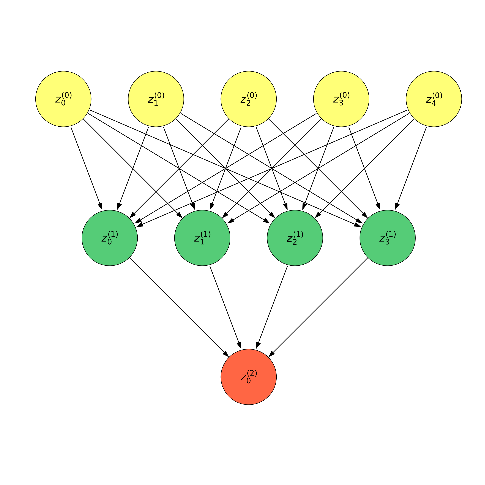

## 前馈神经网络的矢量表示

由概率图模型的知识我们知道:

$$
P(z^{(0)}, z^{(1)}, z^{(2)}) = P(z^{(0)})P(z^{(1)}|z^{(0)})P(z^{(2)}|z^{(1)})
$$

其中

$$
\begin{aligned}
&P(z^{(0)}) = \begin{bmatrix}P(z_0^{(0)}), P(z_1^{(0)}), P(z_2^{(0)}),P(z_3^{(0)}), P(z_4^{(0)})\end{bmatrix}\\
&P(z^{(2)}) = \left[ P(z_0^{(0)})\right]\\
&P(z^{(1)}|z^{(0)}) =
\begin{bmatrix}
P(z_0^{(1)}|z_0^{(0)}) & \cdots & P(z_3^{(1)}|z_0^{(0)})\\
\vdots & \ddots & \vdots\\
P(z_0^{(1)}|z_4^{(0)}) & \cdots & P(z_3^{(1)}|z_4^{(0)})\\
\end{bmatrix}\\
&P(z^{(2)}|z^{(1)}) = \left[P(z_0^{(2)}|z_0^{(1)}), \cdots, P(z_0^{(2)}|z_3^{(1)}) \right]
\end{aligned}
$$