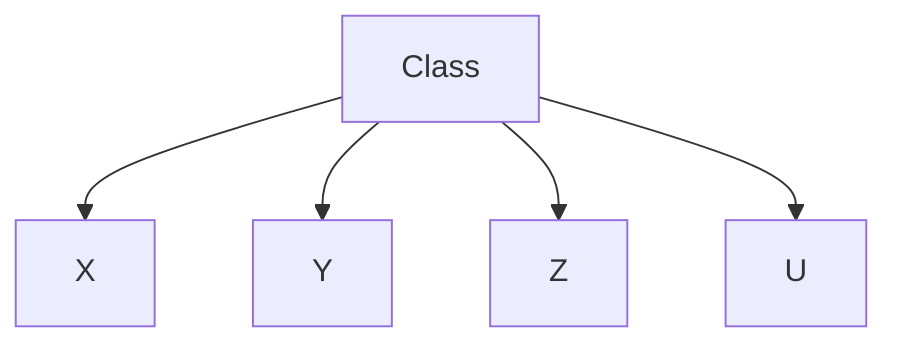
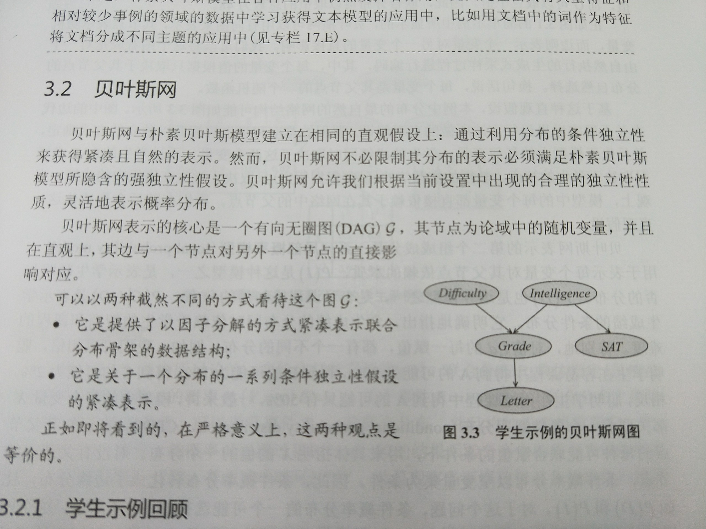

## 朴素贝叶斯模型

**朴素贝叶斯模型**假设所有的事例属于若干两两互斥且包含所有事例情况的类 (class) 中的一个, 即存在一个在某个集合 $\{c^1,\cdots,c^k\}$. 同时模型还包括一定数量的、可观测到其值的**特征** (feature) $X_1,\cdots, X_k$. 朴素贝叶斯假设是在给定事例的类的情况下, 这些特征条件独立. 换言之, 在事例的每个类中, 不同的性质可以独立的确定. 对所有的 $i$, 形式化表达为:

$$
(X_i \bot \boldsymbol{X}_{-i}|C)
$$

其中, $\boldsymbol{X}_{-i} = \{X_1, \cdots,X_k\} - X_i$, 该模型可以使用类似下图的贝叶斯网来表示:

基于这些独立性假设, 模型的**因子分解** (factorization) 可以表示如下:

$$
P(C, X_1,\cdots,X_k) = P(C)\displaystyle\prod_{i=1}^k P(X_i|C)
$$

在这个模型中, 我们可以使用少量的因子来表示联合分布: 一个先验分布 $P(C)$ 用来具体指明一个事例在多大程度上先验地属于不同类, 以及一系列条件分布 $P(X_j|C)$, 其中每个分布与 $k$ 个结果变量中的一个对应. 易知, 参数的个数与变量的个数呈线性关系.

## 贝叶斯网

