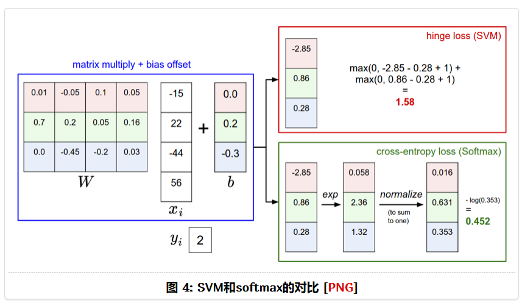

# 图像分类简介

图像分类是计算机视觉的核心任务, 比如对象识别、图像标注、行为识别均可转换为图像分类问题, 而卷积神经网络 (CNN, Convolutional Neural Network) 是图像分类的核心工具.

RGB 图像通常表示为三维数组, 其数据类型为 uint8. 计算机仅仅可以识别这些数字, 下面以一张图片为例来说明图像分类问题.

该图片被计算机识别为 $296 \times 474 \times 3$ 的数组, 矩阵的每一个元素对应于一个像素值, 而图像分类模型 (仅仅考虑 $3$ 分类问题) 的算法设计思想便是: 如何从这一堆数字中识别出其属于猫, 狗, 熊的概率分别是多少, 然后选择概率最高的作为模型的输出.

## 最近邻分类器

最近邻分类器（NNC，Nearest Neighbor Classifier）容易实现，本文通过它介绍图像分类的基本方法流程，但是在实际应用中很少使用该方法。对 NNC，train 训练阶段就是记住所有的图像及其标签，predict 预测阶段就是输出最相似图像的标签。

最近邻算法度量两张图片的相邻程度，通常采用像素值之间的 $L_1$ 距离（Manhattan Distance）或 $L_2$ 距离（Euclidean Distance）.

在 CIFAR-10 数据集上，用 $L_1$
距离得到的分类正确率大约是 $38.6\%$，$L_2$ 距离得到的分类正确率大约是 $35.4\%$，高于随机猜想 $10\%$ 的精度，目前最先进的卷积神经网络（CNN，convolutional neural networks）正确率[在 $95\%$ 以上](https://www.kaggle.com/c/cifar-10/leaderboard)。NNC 的训练时间短，但是测试时耗很长。通常实际应用中，测试时耗更重要，CNN 就是训练耗时但测试高效。
在度量两个向量差异时，$L_2$ 的效果比 $L_1$ 糟糕（That is, the $L_2$ distance prefers many medium disagreements to one big one. ）。

### 最近邻算法探讨

k最近邻算法的主要优点是容易理解和实现，并且训练不时耗；主要缺点是测试（预测）时耗高。在实际应用中，主要关注的是测试（预测）时耗。深度神经网络（DNN，Deep Neural Networks）相反，训练耗时但预测高效，在实际中更适用。
最近邻算法也是一个活跃的研究领域。近似最近邻算法（ANN，approximate nearest neighbor）通过对精度和速度（空间）耗费的折中提高效率，比如FLANN。这些算法通常需要通过kd树或k均值算法预处理或建立索引。
k最近邻算法有时是不错的选择，尤其是数据维数较低的时候，但在图像分类中几乎很少使用：

- 图像是高维数据，高维空间的距离度量有些反直觉（counter-intuitive）;
- 测试时耗太高。

实际上，像素级别的距离度量无法判断基于直觉和语义的相似性。

上图用 [t-SNE](https://lvdmaaten.github.io/tsne/) 展示 CIFAR-10 的图像, 在像素级的 $L_2$ 距离度量下, 相似的图像相邻排列. 结果表明并所非所期望的那样: 同类别的相邻排列. 实际上, 这种度量严重受背景和颜色分布的影响, 并非真正度量图像内容的相似性.

k最近邻算法在实际使用中的建议：

- 数据预处理：特征向量均值归0化、方差单位化[^1]；
- 对高维数据用 [PCA](http://cs229.stanford.edu/notes/cs229-notes10.pdf) 或[随机投影](http://scikit-learn.org/stable/modules/random_projection.html)（random projections）等算法降维处理；
- 根据前文建议采用验证（$50\%$ 到 $90\%$ 数据作为训练集）或交叉验证，通常 `fold` 数越多，效果越好，但也越耗时；
- 通过验证集选择 k（候选 k 越多越好）和距离度量方式；
- 如果算法太耗时，尝试采用 ANN 加速。

[^1]: We will cover this in more detail in later sections, and chose not to cover data normalization in this section because pixels in images are usually homogeneous and do not exhibit widely different distributions, alleviating the need for data normalization.

## 线性分类器

与最近邻方法不同，线性分类器是一种参数化方法（Parametric Approach）。

下面主要参考 [Convolutional Neural Networks for Visual Recognition](1) 课程笔记。

k-NN 在训练时只是记住了所有的样本，占用空间大，在识别时需和训练集的所有图片比较，耗费时间长。因此，需要开发新的方法克服 kNN 存在的问题，新方法包含两个关键部分：

- **评分函数**（score function）：将输入图像映射为所属类别的评分；
- **损失函数**（loss function）：度量预测的评分与真实结果之间的一致性，也称为代价（cost）函数或目标（objective）函数。当评分函数输出结果与真实结果之间差异越大，损失函数输出越大。

训练时，通过最小化损失函数，得到评分函数的参数；分类时，通过对输入图像所属的类别评分，判断图像的类别。

训练集的图像 $\mathbf{x}_i \in \mathbb{R}^D$ ($i = 1, 2, \ldots, N$) 对应的标签 $y_i \in \{1, 2, \ldots, K\}$, 表示训练集有 $N$ 张图片, 每张图片表示为一个 $D$ 维向量, 图像可以分为 $K$ 个类别. 对于 CIFAR-10 数据集, $N=50\,000, D = 32 \times 32 \times 3, K= 10$. 评分函数 $f:\mathbb{R}^D \mapsto \mathbb{R}^K$, 将图像数据映射为所属类别的评分.

**线性分类器**（linear classifier）就是一个评分函数，它是一个线性映射

$$
f(\mathbf{x}_i, W, b) = W\mathbf{x}_i + b
$$

若将图像追加一个值为 $1$ 的“特征”，可将偏移向量 $b$
合并到权值矩阵 $W$ 中，上面的公式可以改写为

$$
f(\mathbf{x}_i, W) = W\mathbf{x}_i
$$

在机器学习中，将输入特征归一化是常用的技术。在实际中，将图像的每维特征（像素）减去均值中心化，对图像而言就是将每张图像减去平均图像，得到新图像的像素取值范围是 $[−127,127]$. 还可进一步将特征取值规范化到 $[−1,1]$ 区间。

在线性分类器（评分函数）基础上，通过定义不同损失函数，可得到具备不同特性的多分类支持向量机和 softmax 分类器。

## 多分类支持向量机

## softmax分类器

更多内容参考：

- [linear SVM](http://cs231n.github.io/linear-classify/)
- [Deep Learning using Linear Support Vector Machines](https://arxiv.org/abs/1306.0239)