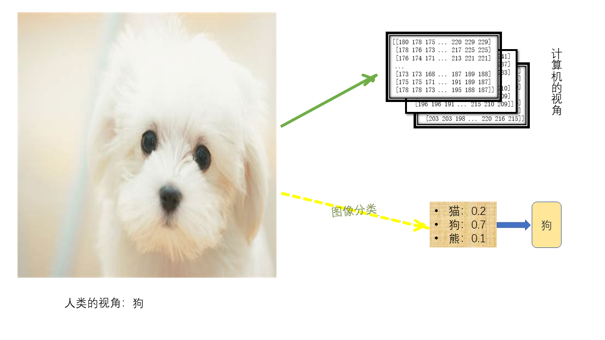

[^0]: 张顺,龚怡宏,王进军.深度卷积神经网络的发展及其在计算机视觉领域的应用[J/OL].计算机学报,2017:1-29[2018-10-08].http://kns.cnki.net/kcms/detail/11.1826.TP.20170918.2025.006.html.

[^1]: A. J. Smola and B. Schölkopf, On a kernel-based method for pattern recognition, regression, approximation, and operator inversion, Algorithmica 1998, 22, 211-231.

[^2]: Anwar H, Zambanini S, Kampel M, et al. Efficient Scale- and Rotation-Invariant Encoding of Visual Words for Image Classification[J]. IEEE Signal Processing Letters, 2015, 22(10): 1762-1765.

[^3]: Presenters Peter, G. B. Enser, Christine J. S, Paul H. Lewis and Jonathon S. Hare.The Reality of the Semantic Gap in Image Retrieval.1st International Conference on Semantic and Digital Media Technologies, 2006.

[^4]: LeCun, Y., Bottou, L., Bengio, Y., & Haffner, P. (1998). Gradient-based learning applied to document recognition. Proceedings of the IEEE, 86(11), 2278-2324.

[^5]: Krizhevsky, A., Sutskever, I., & Hinton, G. E. (2012). Imagenet classification with deep convolutional neural networks. In Advances in neural information processing systems (pp. 1097-1105).

[^6]: Simonyan, K., & Zisserman, A. (2014). Very deep convolutional networks for large-scale image recognition. arXiv preprint arXiv:1409.1556.

[^7]: Szegedy, C., Liu, W., Jia, Y., Sermanet, P., Reed, S., & Anguelov, D. & Rabinovich, A.(2015). Going deeper with convolutions. In Proceedings of the IEEE conference on computer vision and pattern recognition (pp. 1-9).

[^8]: He, K., Zhang, X., Ren, S., & Sun, J. (2016). Deep residual learning for image recognition. In Proceedings of the IEEE conference on computer vision and pattern recognition (pp. 770-778).

[^9]: Huang, G., Liu, Z., Weinberger, K. Q., & van der Maaten, L. (2017). Densely connected convolutional networks. In Proceedings of the IEEE conference on computer vision and pattern recognition (Vol. 1, No. 2).

[^10]: 概半图模型：原理与技术 / (美国) Kollcr D., (以) Friedman N. 著, 王飞跃, 韩素青译. 北京: 清华大学出版社, 2015.

[^11]: Zhu X, Ghahramani Z.Learning from labeled and unlabeled data with label propagation.Pittsburgh: Carnegie Mellon University, 2002

[^12]: 匡继昌.实分析与泛函分析[M].北京:高等教育出版社.2002.8.

[^13]: He, K., Zhang, X., Ren, S., & Sun, J. (2016, October). Identity mappings in deep residual networks. In European Conference on Computer Vision (pp. 630-645). Springer, Cham.

# 基于 CNN 提取特征进行标签传播

摘要: 在当下技术引领下人们更加容易获得各种各样图片数据, 但是对图像的所属类别仍然需要人们花费大量的精力去手工标注, 因而图像分类技术仍然是现在的研究热点. 为了获得更高的分类精度, 人们设计了很多的算法来提取不同层次的特征. 往往浅层机器学习算法效果并不是很好, 即使分类精度很高, 也是需要花费人们太多的精力去研究如何设计特征. 对此, 深度学习的端到端的学习模式极大的缓解了特征工程的大部分难题, 尤其是在图像分类任务上, 深度学习技术表现出了极为出彩的分层特征提取, 逐层抽象等优点. 本文在 Cifar10 数据集上提出了基于 CNN 提取特征进行标签传播的思想. 本文先是从 ImageNet 数据集上迁移学习了 ResNet 到 Cifar10 数据集上, 利用该 ResNet 的特征提取层提取 Cifar10 的高级特征, 然后该高级特征进行降维处理, 最后使用降维后的特征来做标签传播. 本文这样做既考虑
到了使用深度学习技术提取到的比较好的特征, 提高特征提取的质量, 同时也考虑了无标签数据之间的相似性且通过降维来去除冗余的特征.

关键词: 标签传播; 卷积神经网络; 图像分类; 迁移学习

# 1 引言

## 1.1 研究的背景与意义

图像分类是计算机视觉的核心任务, 比如对象识别、图像标注、行为识别均可转换为图像分类问题. 本文考虑 RGB 图像, 它通常表示为三维数组, 其数据类型为 uint8. 计算机仅仅可以识别这些数字, 下面以一张图片为例来说明图像分类问题.

一般地, 图像分类模型均是数据驱动的, 即根据带有分类标签图像集合 (训练集) 训练一个模型, 然后对给定的新的图像通过已经训练好的模型预测它属于哪个分类标签 (或者给出属于一系列不同标签的可能性). 对于人类来说, 识别上图是否是一只 "狗" 是很简单的任务, 然而对于计算机来说就显得尤为困难, 计算机一般会识别其为 $296 \times 474 \times 3$ 的数组, 每一个元素对应于一个像素值. 受拍摄视角, 图片尺寸, 光照条件等各种因素干扰, 像素值会发生改变, 哪怕是一点轻微的色调扰动都会增加计算机对图片的识别准确度.

尽管诸如支持向量机分类器 (SVM[^1]) 和视觉词袋模型 (bag of visual word[^2]) 已经在许多数据集上取得了不错的效果, 但是"语义鸿沟" (semantic gap[^3]) 问题 (计算机表示的底层图像特征和人类所感知的高层语义信息之间的跨度问题) 并没有得到更好的解决. 但是, 卷积神经网络[^0]的出现, 为语义鸿沟问题的解决提供了一个比较好的策略.

近几年来, 以卷积神经网络为代表的深度学习技术在在算机视觉方面方面取得了许多远远超出普通的机器学习算法的傲人的佳绩. 更甚者, 部分使用 CNN 做图片分类的精度也超出了手工标注获得的精度. 卷积神经网络经历了 LeNet[^4], AlexNet[^5], VGG[^6], GoogleNet[^7] (Inception), ResNet[^8], Densnet[^9] 等变革, 卷积神经网络变得越来深, 同时训练难度也不断变大. 考虑到计算设备, 数据集的规模等的制约, 迁移学习在计算机视觉中扮演的角色也越来越重要. 同时半监督学习对于图片分类任务也是至关重要的, 但是仅仅使用浅层机器学习进行标签传播远远无法满足当今社会的需求. 鉴于此, 本文在 Cifar10 数据集上做了一些尝试: 利用 ResNet 提取图片的高级特征表示来不断缩短其与高级语义之间的"鸿沟", 同时通过降维技术去除高级表示的信息冗余, 然后对其使用标签传播算法进行模型的优化.

## 1.2 符号说明

在半监督学习中获取的训练数据通常由两个部分组成, 分别是 $n$ 维输入随机向量[^10] $\mathbf{X}=(\mathbf{X}_1, \mathbf{X}_2, \cdots, \mathbf{X}_n)^T$ 和输出随机变量 $\mathbf{Y}$. 其中 $\mathbf{X}_i$ 表示第 $i$ 个特征随机变量. 本文仅仅考虑图像分类问题, 此时 $\mathbf{Y}$ 的可能取值为 $1, 2, \cdots, c$, 其中 $c$ 表示图像的类别数目. 本文默认所有向量或者向量形式为列向量.

下面的 $\hat{}$ 均表示预测值. 有数据集 $T = \{(x_{i},y_{i})\}_{i=1}^l \cup \{x_{j}\}_{j=l+1}^m$. 其中 $\{x_{i}\}_{i=1}^m$ 为 $\mathbf{X}$ 的 $m$ 个观测值, $\{y_i\}_{i=1}^l$ 为 $\mathbf{Y}$ 的 $l$ 个观测值. 有 $y_i \in \{1, 2, \cdots, c\}$, 其中 $c$ 为类别数目. 约定:

$$
\begin{cases}
X_l = (x_1, x_2, \cdots, x_l)^T\\
X_u = (x_{l+1}, x_{l+2}, \cdots, x_{m})^T\\
Y_u = (y_1, y_2, \cdots, y_l)^T
\end{cases}
$$

对于任意 $1 \leq i \leq l$, 假设存在映射 $f$, 有 $f(x_i) = y_i + \epsilon_i$, 其中 $\epsilon_i$ 看作随机噪声. 图像分类的任务之一便是尽可能的减少噪声, 为此, 本文先来探究一下标签传播. 首先, 本文令
$$
\begin{aligned}
&\hat{Y}_l = (f(x_1), f(x_2), \cdots, f(x_l))^T\\
&\hat{Y}_u = (f(x_{l+1}), f(x_{l+2}), \cdots, f(x_m))^T\\
&\hat{Y} = (Y_l; Y_u)
\end{aligned}
$$

## 1.3 标签传播

由于通过爬虫等技术可以获得大量无标签的数据, 而获得有标签的数据需要花费大量的人力, 物力和时间. 考虑到打标的代价太大, 一些学者将目光转向了半监督学习: 尽可能利用少量有标签的数据和大量无标签的数据来优化模型, 使得无标签数据通过半监督学习推断出无标签数据的标签, 完成对无标签数据的打标. 半监督学习的算法有很多, 本文仅仅考虑标签传播算法.

下面构建一个图 ${\mathcal{G}} = (T, E)$, 其中, 边集为 $E = \{e_{ij}: e_{ij} = (x_i,x_j)\}$ ($ 1 \leq i,j \leq m$), 可表示为一个相似度矩阵（affinity matrix）(矩阵中每个元素表示两两之间的相似性分数[^11]) $W$，令 $d_j = \displaystyle\sum_{i=1}^m (W)_{ij}$, 而对角矩阵 $D = \operatorname{diag}(d_1, d_2, \cdots, d_m)$ 被称为**度矩阵**, 则由 $\Delta = D- W$ (称 $\Delta$ 为拉普拉斯矩阵), 则可以定义 $f$ 的能量函数为 (下面出现了矩阵的求导和内积运算[^12])

$$
E(f) = \frac{1}{2} {\displaystyle\sum_{i=1}^{m}\sum_{j=1}^m (W)_{ij} ||f(x_i) - f(x_j)||^2}
= \langle \hat{Y}, \Delta \hat{Y} \rangle
$$

将矩阵分块, 得到

$$
D = \begin{bmatrix}
    D_{ll} & D_{lu}\\
    D_{ul} & D_{uu}
\end{bmatrix};
W = \begin{bmatrix}
    W_{ll} & W_{lu}\\
    W_{ul} & W_{uu}
\end{bmatrix};\Delta = \begin{bmatrix}
    \Delta_{ll} & \Delta_{lu}\\
    \Delta_{ul} & \Delta_{uu}
\end{bmatrix}
$$

故而有

$$
\begin{aligned}
\langle \hat{Y}, \Delta \hat{Y} \rangle
& = \text{Tr}(\hat{Y}^T \Delta \hat{Y})\\
& = \langle \hat{Y_l}, \Delta_{ll} \hat{Y_l} \rangle + \langle \hat{Y_u}, \Delta_{uu} \hat{Y_u} \rangle + 2 \langle \hat{Y_u}, \Delta_{ul} \hat{Y_l} \rangle
\end{aligned}
$$

这里 $\hat{Y_l} = Y_l$, 故而原问题可以转换为:

$$
\underset{\hat{Y_u}}{\arg\min}\;E(f) = \underset{\hat{Y_u}}{\arg\min}\;\langle \hat{Y_u}, \Delta_{uu} \hat{Y_u} \rangle + 2 \langle \hat{Y_u}, \Delta_{ul} Y_l \rangle
$$

因此，由 $\frac{\partial E(f)}{\partial \hat{Y_u}} = 0$, 可知 $\Delta_{uu}\hat{Y}_u = W_{ul} Y_l$.

令 $P = W D^{-1}$, 则 $P$ 被称为**转移概率矩阵**. 类比 $W$ 的分块方式, 对 $P$ 做一样的处理, 则有

 $\hat{Y}_u = P_{uu}\hat{Y}_u + P_{ul} Y_l$.

回到图像分类任务上来, 大多数浅层学习的思路均是将 RGB 图片的三维数组拉直成为一个向量. 一般该向量的维度非常高, 比如本文开头的那张图片的维度是 $420\,912$, 一张图片就有如此高的维度, 可见标签传播在图像分类任务上的难度有多么的大了. 人们已经知道图片数据的像素级别的特征有很高的相关性甚至相互独立的特征极为稀少, 为此人们便想到设计一种算法来降低特征的维度, 此种算法有一个通用的名字: 降维.

## 1.4 降维

降维技术是指提取高维的关键信息, 将高维空间的问题转换为易于计算的低维空间的问题进行求解的过程. 降维是十分有必要的, 因为它缓解了以下三种问题:

- 多重共线性: 预测变量之间相互关联, 这样会导致模型解空间的不稳定性;
- 高维空间的稀疏性: 高维空间的数据往往是稀疏的, 增加了模型求解的难度;
- 过高的维度可能含有大量的冗余信息, 妨碍人们找到变量之间的真正的隐含信息.

本文主要涉及两种降维方法, 无监督的 PCA 和有监督的 LDA. 下面逐一介绍.

### 1.4.1 PCA

PCA 中文叫做**主成分分析法**, 该方法将输入数据 $x$ 正交投影表示为 $z$, 目的是学习该正交投影, 使得降维后的数据尽可能的保留原数据空间的信息. 令 $p<n$, $A \in \mathbb{R}^{n \times p}, A^TA = I_p$, 通常 $A$ 被称为解码矩阵, 且 $A^T$ 被称为**投影矩阵**.

为了保留原始信息, 需要保证**最近重构性**, 即 $\displaystyle\min_A\sum_i ||x_i - Az_i||$ 或者 **最大可分性**, 即 $\displaystyle\max_A ||XA||$.

求得问题的解为

$$
X^TXA = \lambda A
$$

其中, $\lambda$ 是拉格朗日乘子. 这样, 将 $X$ 进行标准化处理, 那么 $X^TX$ 可以看作是样本的协方差矩阵; 再对 $X^TX$ 进行特征值分解, 并求得最大的 $p$ 个特征值所对应的特征向量 (在 PCA 算法中, 一般称作主成分) $A_1,A_2,\cdots,A_p$, 则便可得到 $A^* = (A_1,A_2,\cdots,A_p)$. 因而, 对于任意的 $x_i$, 便可得到其低维表示 $z_i = A^Tx_i$.

### 1.4.2 LDA

LDA 中文叫做线性判别分析, LDA 的核心思想是设法将样本投影到一个子空间上, 且使得同类的样本投影后尽可能的接近而不同类的样本投影后尽可能的分开. LDA 与 PCA 十分相似, PCA 试图找到方差最大的几个主成分, 而 LDA 的目标是发现可以最优化分类的特征子空间. 与 PCA 类似, 需要将 $X$ 进行标准化处理, 然后将数据集按类别划分为 $\{C_1,C_2, \cdots, C_C\}$, 并计算各个子类所在集合的均值向量 $\mu_j, j= 1,2,\cdots, C$, 则不同类间尽可能分离等价于

$$
\displaystyle \max_A \sum_{i,j=1}^C ||A^T(\mu_i - \mu_j)||^2 =  \max_A A^T \sum_{i,j=1}^C (u_i-u_j)(u_i-u_j)^T W = \max_A A^T S_b A
$$

同类之间尽可能接近等价于

$$
\displaystyle \min_A \sum_{x \in C_i} ||A^T(x - \mu_i)||^2 = \min_A A^T \sum_{x \in C_i} (x-u_i)(x-u_i)^T A = \min_A A^T S_w A
$$

构造类间散度矩阵 $S_b$ 以及类内散度矩阵 $S_w$. 故而原问题便转换为以下优化问题:

$$
\displaystyle\max_A \frac{\text{Tr}(A^TS_bA)}{\text{Tr}(A^TS_wA)}
$$

其中 $A$ 相当于 PCA 中的 $A^T$, 被视为投影矩阵. 因而, 与 PCA 类似取 $S_w^{-1}S_b$ 的前 $p$ 大的特征值所对应的特征向量组成 $A$, 最后使用 $A$ 将样本投影到新的特征子空间中.

再次回到图像分类任务上, 通过降维技术, 人们去除了图片像素级特征的冗余信息, 而保留了其大部分关键信息, 减少了模型的计算量. 但是将图片的像素级的特征拉直为一个向量, 破坏了图片的部分邻域相关性和平移不变性. 基于此种情况, CNN 恰恰为该难题的解决提供了强大的支持.

## 1.5 CNN

CNN 中文名字是卷积神经网络. 从技术角度来看, CNN 是一种至少包含一个卷积层 (有滤波器的作用) 的神经网络. 一般地, 一个神经元可以看作是线性映射与非线性映射的组合, 而多层神经网络是多个神经元按照分层结构组合而成的. 神经网络模型的优化方法大都是基于反向传播算法求得的数值解. 本文使用了何恺明等人提出的残差网络[^13] (ResNet). ResNet 网络的基本单元是残差块, 具体见下图

残差块通过跨层的数据通道 (shortcut) 可以使得神经网络变得更深, 且一定程度上缓解了梯度消失和梯度爆炸所造成的一系列问题. ResNet 网络结构有很多, 而本文仅仅使用了 ResNet50 这一结构来拟合半监督学习模型.

在 ResNet 中指出神经网络的训练存在退化问题, 即随着层数加深到了一定的深度之后, 越深的网络训练的效果越差, 但这并不是梯度消失和梯度爆炸引起的问题 (因为已经有许多方法来解决梯度传播的问题). 数据经过了两条路线, 一条与普通神经网络类似, 另一条实现了单位映射的路线 (被称为 shortcut). 这两条路线一般被称为"残差块". 在网络中使用残差块的神经网络被称为 ResNet. ResNet 很好的应对了网络退化问题, 可以使得网络变得很深.

回到图像分类任务上, 神经网络模型具有训练时间长、测试时间短的优点, 只要它在一个好的数据集上训练好了参数, 该模型便具有提取比较好的特征的功能. 对此, 很多人大都选择 ImageNet 数据集上进行模型训练, 然后将训练好的模型保存下来, 由于其强大的特征提取能力, 通过迁移学习人们将会在新的数据集上快速的训练出满意的模型.

# 2 实验与结果分析

## 2.1 数据集简介

ImageNet 几乎是深度学习领域的王牌数据集, 它可以用于图像分类, 目标检测, 对象识别, 检测, 定位等多个领域. ImageNet 有 $1\,500$ 多万幅有标签的图片, 涵盖了 $2$ 万多个类别 (其中有超过百万的图片有明确的类别标注和图像中物体位置的标注). 因而 ImageNet 数据集可以处理绝大多数的计算机视觉任务. 基于此, 人们在该数据集上训练处理许许多多的优秀模型, 为人们进行迁移学习提供了很大的便宜.

Cifar 10 现在已经是深度学习的入门级数据集, 它十分适合对模型做一些简单的预测和微调. Cifar10 分为训练集和测试集, 它有 $10$ 个类别. 其中训练集包含 $50\,000$ 个样本, 而测试集包含 $10\,000$ 个样本, 且尺寸为 $32 \times 32$ 的彩色图片, 因而数据集足以应对一些中小型模型的需求. 类的标记为: airplane、automobile、bird、cat、deer、dog、frog、horse、ship、truck 这些类是完全互斥的, 相互之间没有重叠.

## 2.2 实验

# 3 总结与展望

# 参考文献
